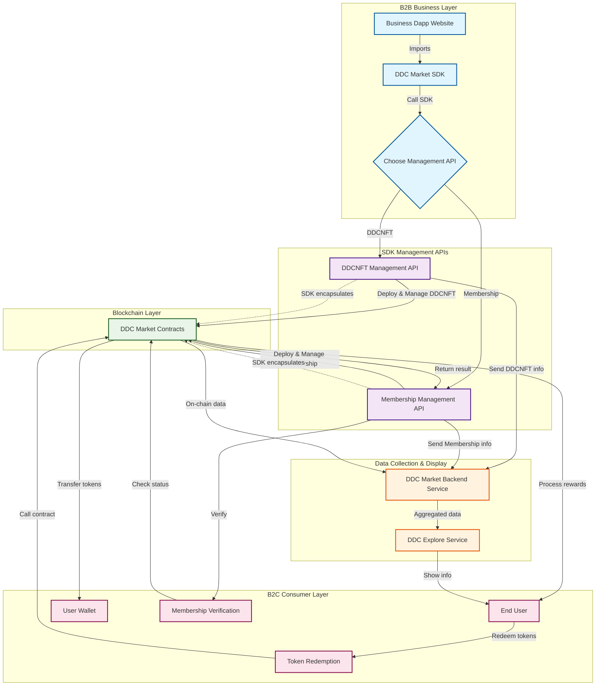

# DDC Market SDK

a SDK that is TypeScript Compatible NPM for DDC Market Contract integration

## Design Idea

Reference to [DDC Market Contracts](https://github.com/DataDanceChain/DDC-Market-Contracts), Empowering any Dapp that intent to integrate DDC Market SDK to realize quick business growth.

## Architecture

Below is an architecture map for DDC Market SDK integration in a Dapp:

**Legend:**

**B2B Business Layer:**

- Business Dapp integrates SDK via NPM
- Business calls SDK to choose management type (DDCNFT or Membership)

**SDK Management APIs:**

- **DDCNFT Management API** & **Membership Management API**: SDK-provided peer-level management interfaces
- Both APIs are at the same level, providing different management functionalities
- Both encapsulate the underlying Blockchain Layer

**Blockchain Layer:**

- **DDC Market Contracts**: Blockchain contract layer
- Encapsulated and called by upper-layer Management APIs
- Handles all actual on-chain operations

**Data Collection & Display (Independent):**

- **DDC Market Backend Service**: Independently collects data from SDK and contracts
- **DDC Explore Service**: Independently displays aggregated information
- Relatively independent from B2B and B2C scenarios, responsible for data collection and display

**B2C Consumer Layer (Independent):**

- **End User**: C-end users as system consumers
- **User Wallet**: User wallet for receiving and storing tokens
- **Token Redemption**: Users redeem tokens to obtain rewards
- **Membership Verification**: B2B side verifies user membership status
- C-end scenario is relatively independent from B2B scenario, both are system users

# Design Requirements

- 作为 Web3 Dapp 的通用库, 需要支持 Browser 和 Node 环境下, 用户使用自己的钱包(Provider), 通过调用 DDC-Market SDK, 实现跟 DDC 合约的交互

- DDC SDK 不仅支持 DDC Layer2 的链上交互, 还提供了 DDC 中心化服务, 帮助用户配置和存储相关信息 用户可以读取和设置相关信息

## Installation

`pnpm install`

## Build SDK

`pnpm build:dev`

## Usage & Examples

- Browser EVM Wallets and [MetaMask Embedded Wallets (formerly Web3Auth)](https://docs.metamask.io/embedded-wallets/sdk/react/advanced/smart-accounts/)

- See /demo folder

## local demo

`pnpm demo:dev`
